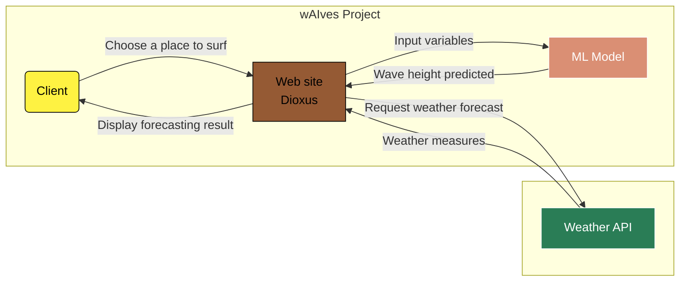

# wAIves 🏄

## Project Objective :
The objective of this **personal** project is to develop **AI** models that predicting Surf conditions based on weather data.  
This involves Data Mining, Supervised Learning, and Web Application development.

## Key Project Steps :
- **Data Mining** : Text Scraping, Data Analysis, and Formatting to build a large dataset (4GB)
- **Supervised Learning** : Training models using *TensorFlow* and *PyTorch* libraries
- **Web Development** : Setting up server logic (each project branch contains a different implementation of this part) and communication with an API (*OpenWeatherMap*)

## Architecture :

## Weather Data :
The weather data collected using *OpenWeatherMap* (and provided to the models) includes: **longitude**, **latitude**, **temperature**, **pressure**, **wind speed**, **wind direction**.  
The value inferred by the models: **wave height**.  
For more information, see the [Data](https://github.com/LugolBis/wAIves/tree/main/DATA) folder.

## Models :
Numerous models have been trained with various parameter variations (epochs, metrics, layers, and datasets).
A major break changes were introduced with wAIves2 small models who were trained by splitting the dataset into small subsets based on the geographical coordinates of the weather stations. This method provide better accuracy and reduce hallucinattion for region who are less represented in the dataset.

These tests have identified the models providing the best results.  
For more information, see the [Models](https://github.com/LugolBis/wAIves/tree/main/Models) folder.

## Online usage :
### [wAIves](https://lugolbis.github.io/wAIves/)

## Dataset sources :
- NOAA
- NDBC
- Météo France
- SeaDataNet
